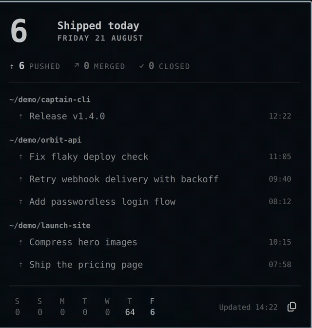
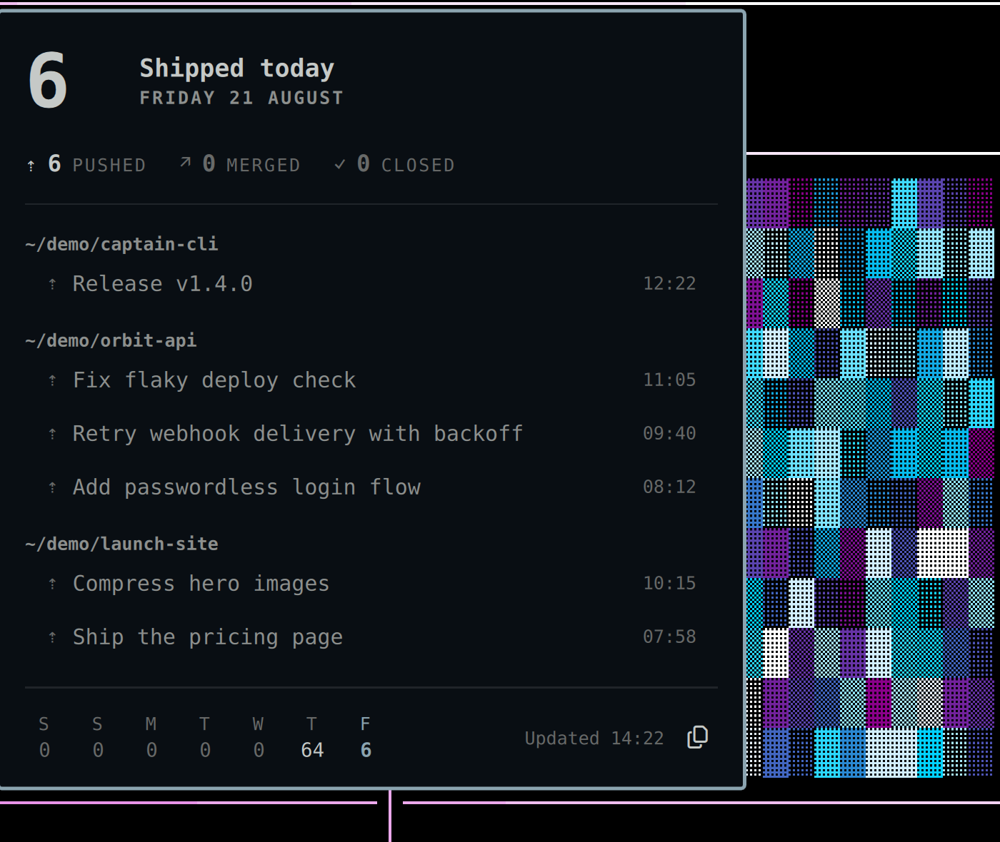

# Shiplog

A captain's log of what you shipped, for the [Omarchy](https://omarchy.org) bar.

Most developer widgets show work you still owe: inboxes, queues, pipelines. Shiplog shows work you finished. It counts merged PRs, pushed commits, and closed issues since midnight, right in the bar. The full log for the day is one click away. Proof of done, not a todo list.






## Features

- Shipped-today count in the bar: commits, PRs, issues
- Click-through panel with the day's log, grouped by repo, with deep links
- GitHub via the `gh` CLI (read-only search; your auth stays in `gh`)
- Local-repos source that works offline and with any remote
- Seven-day strip. Receipts, not analytics: no streaks, no badges, no guilt
- One-click "copy day as Markdown" recap
- Day boundary you can move for night-owl hours
- Follows your theme, in tall and wide bars alike

## Plugin contract

- ID: `io.github.joshuaswarren.shiplog`
- Kind: `bar-widget` (the panel is the widget's popout, per the Quattro convention)
- Works with: Omarchy 4 / Quattro shell

## Requirements

- `gh` (GitHub CLI), signed in. Only for the GitHub source.
- `git`. Only for the optional local-repos source.
- `wl-copy`. Only for the Markdown recap action.

## Installation

```bash
omarchy plugin add https://github.com/joshuaswarren/omarchy-shiplog
```

Remove it the same way:

```bash
omarchy plugin remove io.github.joshuaswarren.shiplog
```

## Usage

- Left-click the chip to open the day's log. Right- or middle-click to refresh now.
- In the panel: arrows move, Enter opens the item, Esc closes. Press `r` to refresh, `c` to copy the day as Markdown, and `s` to save it to the recap archive.
- `omarchy-shell shell toggle io.github.joshuaswarren.shiplog '{}'` toggles the panel. The plugin's own IPC target answers `open`, `close`, `toggle`, `refresh`, `copy`, and `save`:

```bash
quickshell ipc -p "$OMARCHY_PATH/shell" call io.github.joshuaswarren.shiplog copy
quickshell ipc -p "$OMARCHY_PATH/shell" call io.github.joshuaswarren.shiplog save
```

## Configuration

Settings live inline on the plugin entry in `~/.config/omarchy/shell.json`:

```json
{
  "id": "io.github.joshuaswarren.shiplog",
  "sources": ["github"],
  "localRepoDirs": ["~/src"],
  "pollMinutes": 5,
  "countCommits": true,
  "countMergedPrs": true,
  "countClosedIssues": true,
  "hideWhenZero": false,
  "dayBoundary": "00:00",
  "recapDir": ""
}
```

- Add `"local"` to `sources` to scan repos one level under each `localRepoDirs` entry. The scan counts commits made under each repo's own `user.email`. Local-only commits show the repo path instead of a link. They work offline.
- `pollMinutes` is clamped to a 5-minute minimum.
- `dayBoundary` (`"HH:MM"`) lets the "day" end at 04:00 for night owls. Counts reset at the boundary. The finished day moves into the week strip.
- `recapDir` turns on the recap archive. Empty disables it. Set it to a directory (`"~/Documents/shiplog"`) and each day's log is saved there as `YYYY-MM-DD.md`: automatically when the day rolls over (only for days that shipped something), and on demand with the `s` key or the `save` IPC method. The filename is always generated from the date, the write is atomic, and a failed write changes nothing.

## Data sources

All GitHub traffic is REST search via `gh api`, one small burst per poll. Merged PRs and closed issues come from `/search/issues`. Commits come from `/search/commits`. Commit search covers default branches. The local source covers every branch and non-GitHub remotes. The events API is not used, because GitHub now sends `PushEvent` payloads with no commit data.

## Security

Strictly read-only toward GitHub. The plugin runs `gh` and `git` with argument arrays only. No user setting ever passes through a shell. It never touches tokens. It renders remote strings as plain text, opens only `http(s)` links, and never writes to any remote. Local writes are limited to the day-count cache at `~/.local/state/omarchy/shiplog.json` and, only when you set `recapDir`, date-named recap files inside that directory (atomic, generated filenames, fail-closed). Details in [docs/REQUIREMENTS.md §7](docs/REQUIREMENTS.md#7-security).

## Development

```bash
node --test tests/model.test.mjs tests/local-commits.test.mjs
omarchy plugin validate .
```

`Model.js` holds every parse and derivation as pure functions. `Panel.qml` owns polling and UI. `BarWidget.qml` is the chip. Architecture notes live in [docs/ARCHITECTURE.md](docs/ARCHITECTURE.md).

## License

[MIT](LICENSE)
